# Liferay 7.3 Fragments
A complete collection of fragments that can be used independently in any demo.

# Banners
## Dark Slider
A Slider which has a dark overlay to darken the background images in order to use white text over them.

### Screenshot
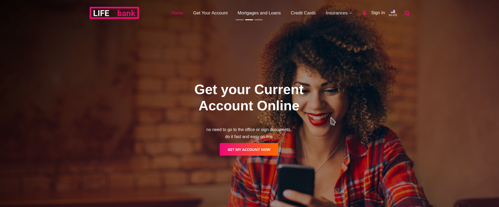

### Options
* **Text color**: you can select the color of the text over the image.
* **Gradient**: select if the button will be a gradient or not.

### Additional comments
* Gradient goes from primary to secondary color.

## Title Area
A full width banner with white text which darken the background image and use a waves overlay. 

### Screenshot
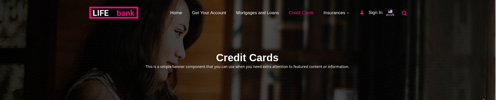

# Buttons
## Gradient Button
A button with background gradient from your primary color to your secondary.

### Screenshot

### Options
* **Text align**: the alignment of the button's text can be selected.
* **spacing**: top and bottom spacing can be selected.

# Headings
## Gradient Underlined Heading
A title which is underlined with a gradient moving line.

### Screenshot
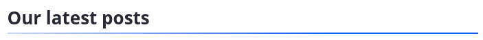

### Options
* **Heading level**: you can configure the level of this heading (h1, h2, h3, h4, h5 or h6).

# KPI Dashboard
## Icon KPI Card

### Screenshot
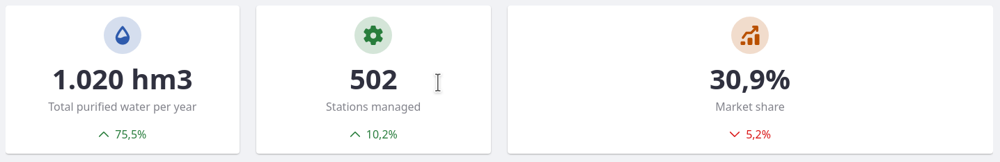

### Options
* **Icon**: The icon can be selected. It's a text field where you must fill in a [Clay Icon name](https://clayui.com/docs/components/icon.html).
* **Color**: The icon's color can be selected as well.

### Additional comments
* The texts inside the card can be modified using the editor.

## IOT Line Chart
A dynamic line chart which can be configured with different values and they will rotate creating a movement efect. Useful to simulate data obtained in real-time.

### Screenshot
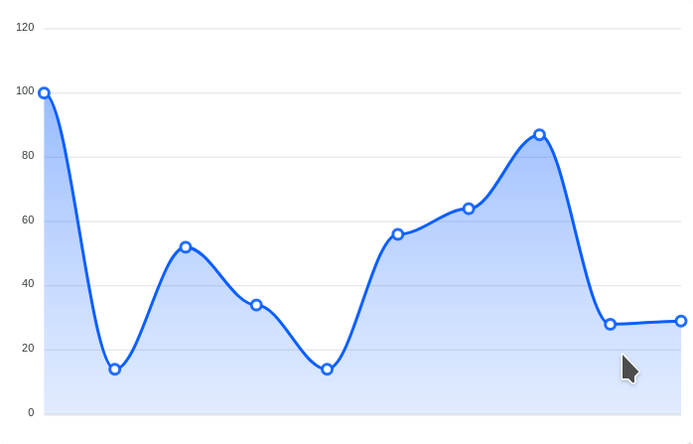

### Options
* **Fragment ID**: If you are going to use more than one of this fragments in a page, you'll need different ids.
* **Stroke Color**: The color of the line in the graph.
* **Data**: Y-Axis values. The more you add the wider will be the graph. `1,2,3,4,5`
* **Interval**: the inteval of update and the difference between the X-Axis values.

### Additional comments
* X-Axis values are automatically established based on the current time and the interval configured.
* Y-Axis values are configured manually.

## KPI ScoreCard

### Screenshot
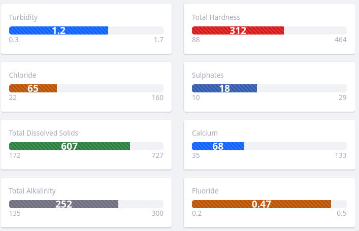

### Options
* **Min and Max**: You can configure starting and ending values.
* **Color**: The progress bar's color can be configured.
* **Current value**: The current value shown inside the bar.

### Additional comments
* The length of the bar will be calculated based on max, min and current values.

## Line Chart
A line chart which shows values by months.
### Screenshot
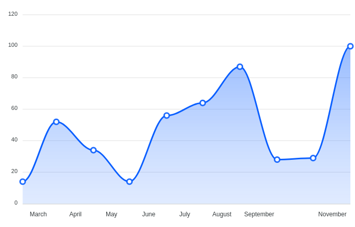

### Options
* **Fragment ID**: If you are going to use more than one of these fragments in a page, you'll need different ids.
* **Stroke Color**: The color of the line in the graph.
* **Data**: Y-Axis values. The more you add the wider will be the graph. `1,2,3,4,5`

### Additional comments
* X-Axis values are automatically established based on the current month.
* Y-Axis values are configured manually.

## Pie Chart
A monochromatic pie chart.
### Screenshot
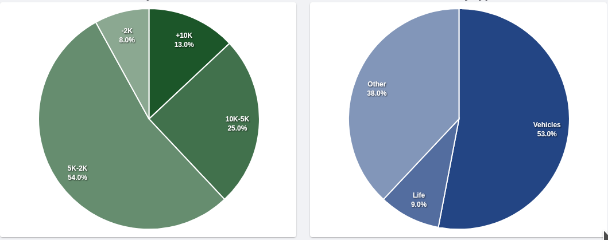

### Options
* **Fragment ID**: If you are going to use more than one of this fragments in a page, you'll need different ids.
* **Color**: The color of the chart.
* **Data**: Values for each section of the pie. `1,2,3,4,5`
* **Labels**: Labels for each value. Same order: `"Team A, Team B, Team C"`

### Additional comments
* The more values you add the more sections will have the pie.
* The labels are assigned to values in ascending order. 

## Progress KPI
### Screenshot
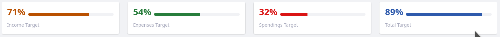

### Options
* **Progress**: The progress value.
* **Color**: The progress bar's color can be configured.

### Additional comments
* The length of the bar will be calculated based on the progress value.

# Menus
## Sidebar Menu
A responsive sidebar menu. It has integrated the personal-bar, search box and copyright area.
### Screenshot
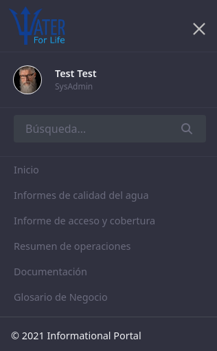

## Sticky Menu
A responsive sticky menu. It has integrated personal bar, search and fields for email and phone.
### Screenshot
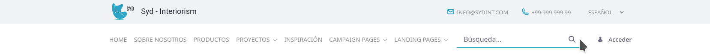
-
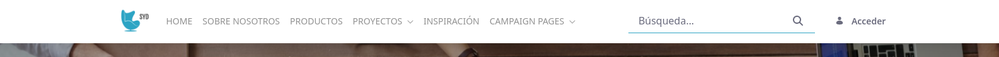

### Options
* **Background Color**: you can select the top bar's background color
### Additional comments
* The number of items is limited due to the width 
* The company name can be shown when the menu is not sticky, when you scroll down it disappears. 

# Utils
## Customizable Modal
### Screenshot
### Options
* **Delay**: Delay in ms to show the modal.
* **Footer button style**

## User Welcome
A user welcome message area, with a link to the user's profile and the user's portrait.
### Screenshot

### Options
* **Background Color**
* **Text color**